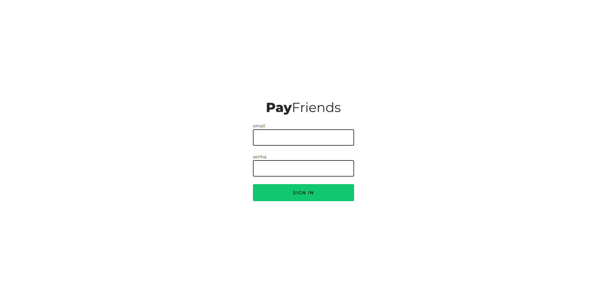
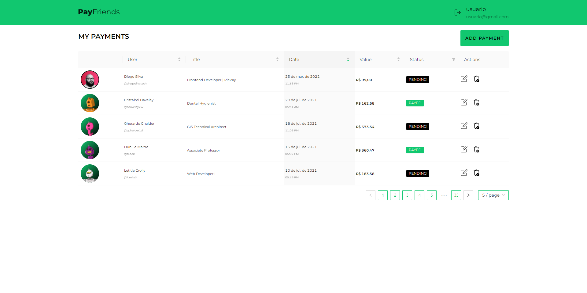
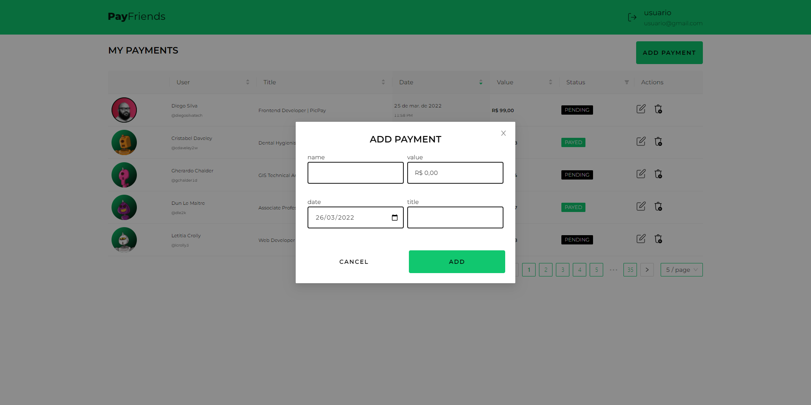
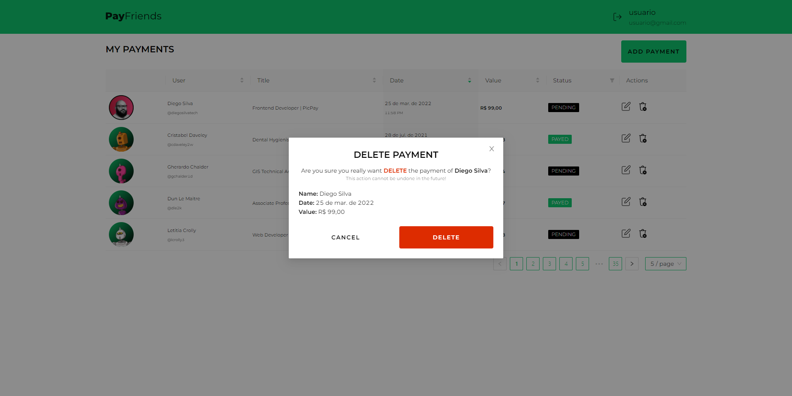
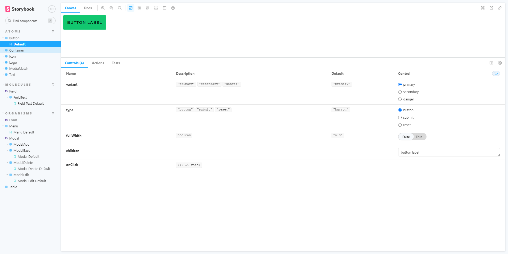
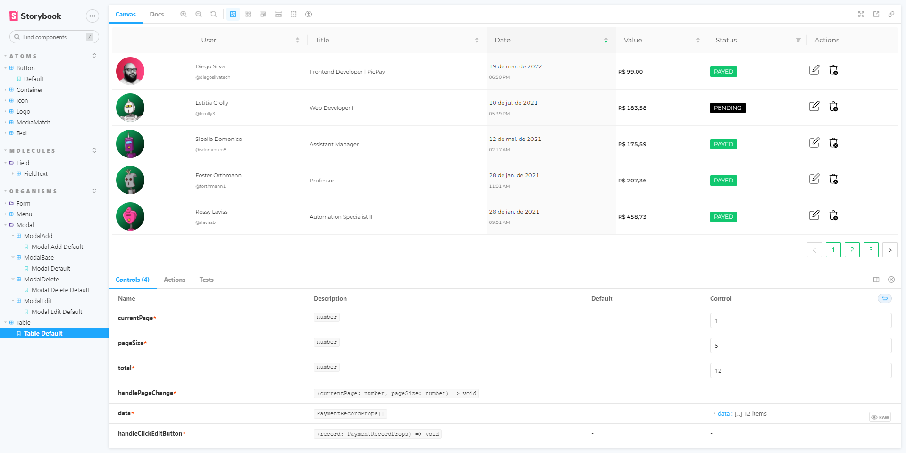

# CASE | PICPAY FRONTEND

##### react, typescript, styled-componets, storybook, jest, heroku and more...

---


## ABOUT THIS PROJECT

This project contains the entire frontend application. The **Frontend** application was designed to meet the company's front end development test **[PICPAY](https://www.picpay.com/)**.

This application is also available at the links: 
- [x] Frontend [https://case-picpay-frontend.netlify.app/](https://case-picpay-frontend.netlify.app/)
- [x] Storybook [https://case-picpay-frontend-storybook.netlify.app/](https://case-picpay-frontend-storybook.netlify.app/)
- [x] API [https://case-picpay-api.herokuapp.com/](https://case-picpay-api.herokuapp.com/)

<p align="center">
  
  
  
  
  
  
</p>

---

## AVALIABLE SCRIPTS

At first, in the project directory, you need run:

```jsx
// installing the dependencies
yarn install
```

```jsx
// run json-server on http://localhost:8000/
yarn start:api
```
_you can see the **server** in production at the link: [https://case-picpay-api.herokuapp.com/](https://case-picpay-api.herokuapp.com/)._

```jsx
// run project on http://localhost:3000/
yarn start
```
_run the app in the development mode by opening [http://localhost:3000](http://localhost:3000) to view it in the browser. The page will reload if you make edits._

_**if you prefer**, you can see the **frontend application** in production at the link: [https://case-picpay-frontend.netlify.app/](https://case-picpay-frontend.netlify.app/)._

```jsx
// creates .jest-test-results.json file to @storybook/addon-jest
yarn test:generate-output
```

```jsx
// runs storybook on http://localhost:6006/
yarn storybook
```

### OTHER SCRIPTS AVAILABLE

```jsx
// runs the linter in all components and pages
yarn lint
```

```jsx
// runs jest to test all components and pages
yarn test
```

```jsx
// runs jest in watch mode
yarn test:watch
```

```jsx
// creates a new component. to create a Button component, for example, run: yarn generate Button
yarn generate component <ComponentName>
```

```jsx
// creates a new icon. to create a Arrow icon, for example, run: yarn generate icon Arrow
yarn generate icon <IconName>
```

```jsx
// build project
yarn build
```

_Learn how to install `yarn` through the [official documentation](https://yarnpkg.com/pt-BR/docs/install)._

---

## MAIN TECHNOLOGIES USED

### [axios](https://github.com/axios/axios/)

> To make queries on external API's.

### [typescript](https://www.typescriptlang.org/)

> To give more power to my JavaScript code.

### [react-router-dom](https://reactrouter.com/)

> To manage the application routing system.

### [styled-components](https://styled-components.com/)

> To stylize my app as components.

---

## ABOUT ME


